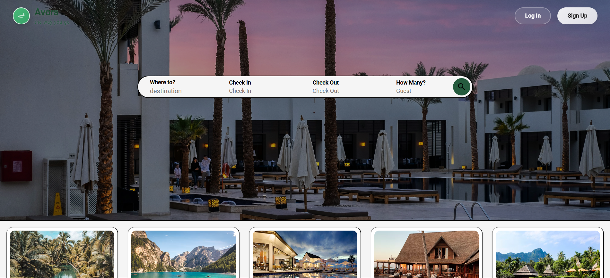
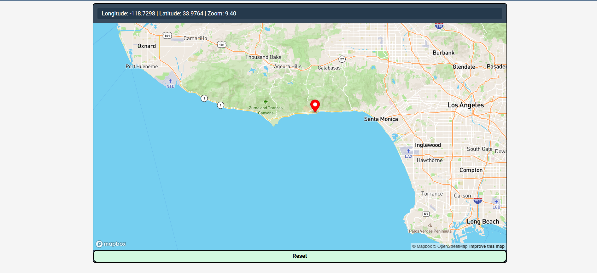
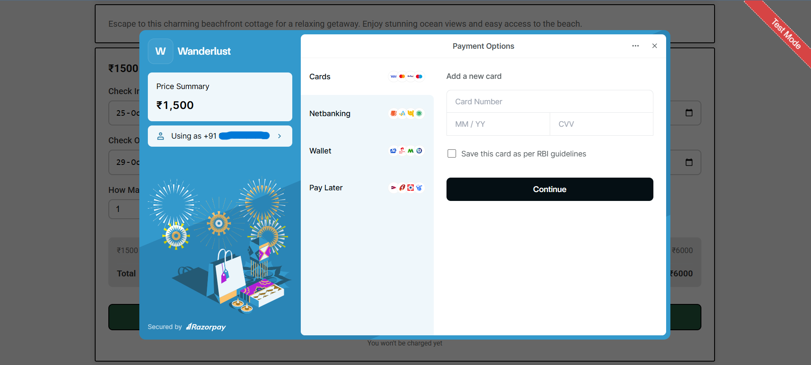
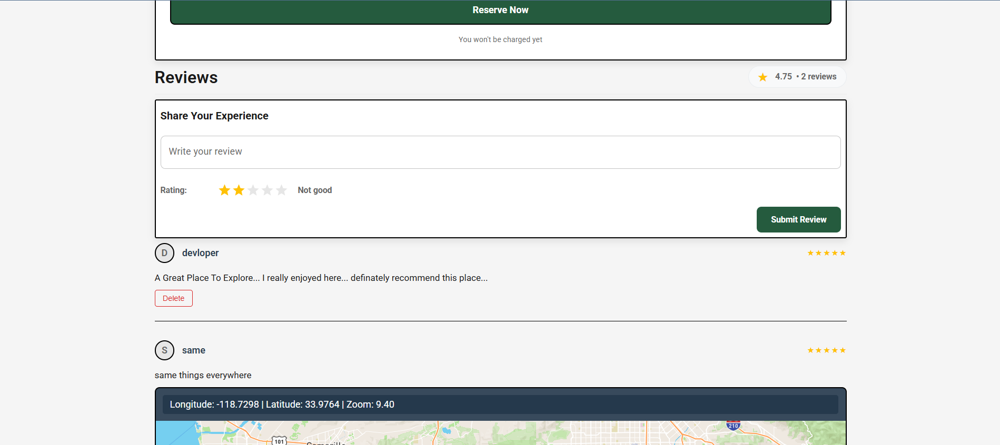
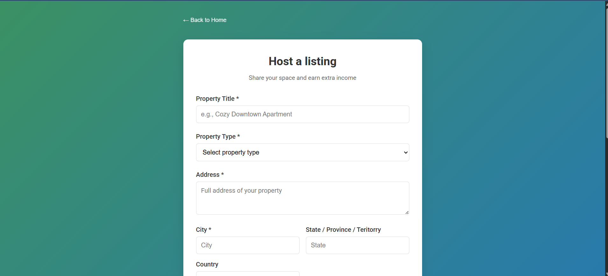
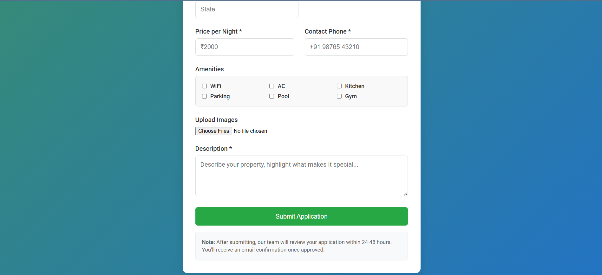
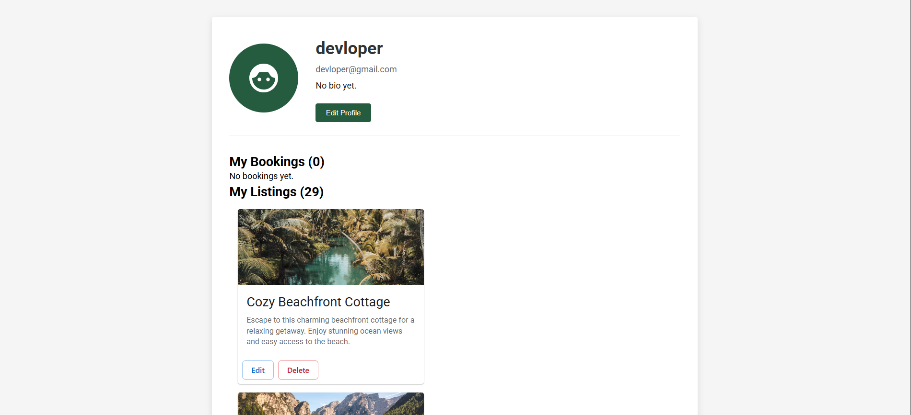

# 🌐 Avora

> A full-stack web application for seamless stay booking and management — powered by modern web technologies, strong authentication, and secure payments.

---

## 🚀 Overview

**Avora** is a full-stack web application inspired by the idea of exploring and booking stays, similar to Wanderlust (Airbnb clone).  
It’s a re-engineered version built using **React**, with a focus on **real-world scalability, user authentication, payments**, and a **modern responsive UI/UX**.

This project showcases best practices in **frontend–backend integration**, **JWT authentication**, and **secure payment flows** using Razorpay.

---

## ✨ Features

- 🔐 **Authentication & Authorization** — Secure login/signup using **JWT**
- 💳 **Payment Gateway Integration** — Razorpay-based seamless payment checkout
- 🧑‍💼 **Profile Management** — Personalized user dashboard and booking history
- 🧭 **Transparent Navbar & Modern UI** — Elegant design with smooth transitions
- 📱 **Fully Responsive Design** — Optimized for both desktop and mobile
- ⚙️ **Reusable Components** — Clean React architecture for scalability
- 🧩 **RESTful APIs** — Efficient backend communication

---

## 🧠 Tech Stack

| Category | Technologies |
|-----------|---------------|
| **Frontend** | React, React Router, Axios, Mapbox, MUI|
| **Backend** | Node.js, Express.js, Cloudinary, JWT, Razorpay |
| **Database** | MongoDB (Mongoose ORM) |
| **Deployment** | Vercel (frontend) and Render(backend) |

## Screenshots for better understanding

<h2>Home Page</h2>

<h2>Login Page</h2>

<h2>Map</h2>

<h2>Payment</h2>

<h2>Reviews</h2>

<h2>Listing</h2>

<h2>Host Listing</h2>

<h2>Profile</h2>

<h2>Footer</h2>

